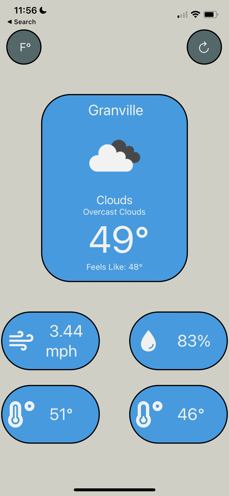
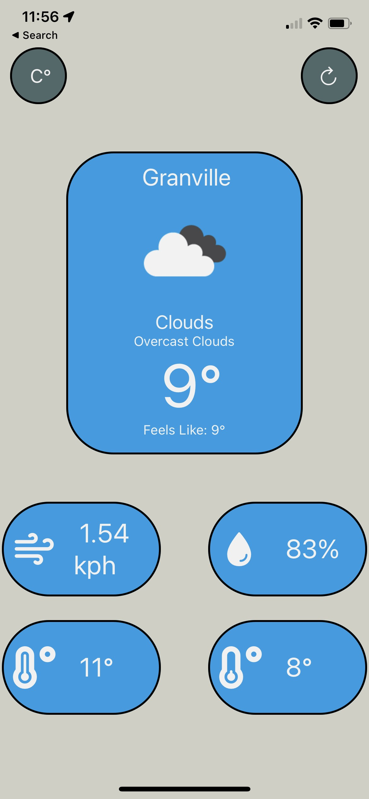

Weather App
===========

This app was made by me to practice learning react native. 

To start the app
================
Clone the repository to your local machine
### `git clone url`
Inside the project folder 
### expo start

API Used
========
I used a free api from https://openweathermap.org/ to get the current weather data 

Images of app
=============

